# Energy Generation Predictor - MLops⚡

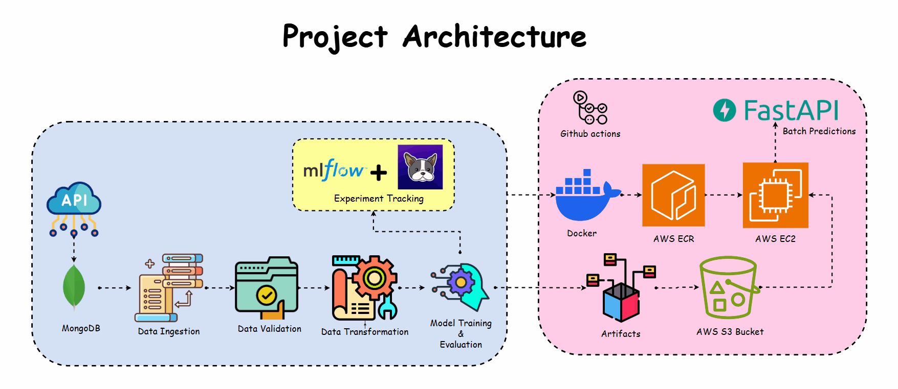

This repository contains a comprehensive end-to-end MLOps project focused on predicting hydro energy generation in New York City using LSTM models. The project leverages modern MLOps principles to create a fully automated pipeline for data processing, model training, deployment, and monitoring, ensuring scalability and reliability in energy forecasting.

## Introduction
Hydro energy generation is a vital component of New York City's renewable energy infrastructure. Accurate predictions of energy output are crucial for efficient energy management, enabling better planning and distribution. This project utilizes historical hydro energy data to develop a machine learning model that can forecast future energy generation, providing valuable insights for energy providers and city planners.

## Objective 🎯
The objective of this project is to build an end-to-end machine learning pipeline to predict hydro energy generation in New York City. The project implements MLOps principles to automate the entire workflow from data ingestion to deployment using cloud services and CI/CD pipelines.

## Problem Statement 🔍
Hydro energy generation is subject to various environmental factors, and accurate predictions are essential for optimizing energy generation, distribution and management. This project aims to create a robust prediction model using historical hydro energy generation data and deploy it in a scalable, automated environment that supports continuous integration and deployment.

## Tech Stack 🛠️

| **Category**          | **Technology**        | **Purpose**                                                    |
|-----------------------|-----------------------|----------------------------------------------------------------|
| Database              | MongoDB               | Used for data ingestion                                         |
| Machine Learning Model| LSTM                  | Long Short-Term Memory model for time series prediction         |
| Programming Language  | Python                | Core language for the entire project                            |
| Experiment Tracking   | DagsHub               | Remote repository to track experiments and version control       |
| Experiment Tracking   | MLflow                | Local tracking of experiments                                     |
| Framework             | FastAPI               | For building the API for batch predictions                      |
| Containerization      | Docker                | To containerize the application for consistency across environments |
| CI/CD                 | GitHub Actions        | Automates testing, building, and deployment                     |
| Cloud Storage         | AWS S3                | Stores model artifacts in the cloud                             |
| Container Registry    | AWS ECR               | Stores Docker images for deployment                             |
| Deployment            | AWS EC2               | Self-hosted runner for GitHub Actions, enabling deployment      |
 
## Training Pipeline Stages 📊


The training pipeline for the Energy Generation Predictor project is organized into several key stages. Each stage is designed to process the data, validate it, transform it, and finally train the model. Below is a breakdown of the pipeline stages:

1. **Data Ingestion**📥

This is the first stage of training pipeline, where hydro energy generation data from a MongoDB database, cleans it and converts it into a Pandas DataFrame. The data is then split into training (70%), validation (12%), and test (18%) sets. The output is a DataIngestionArtifact containing file paths to these datasets, ready for the next pipeline stage.
 
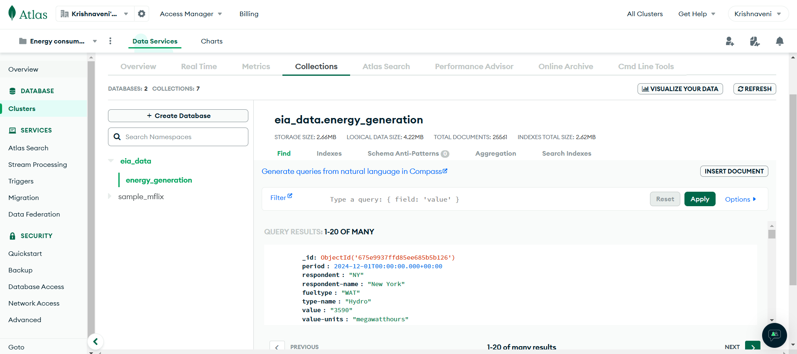

2. **Data Validation**✔️
  
This stage ensures data integrity by verifying column counts and required numerical and datetime columns. It detects data drift between base and current datasets using statistical tests. Validated datasets are saved, and a DataValidationArtifact is produced with paths to the validated data and a drift report.

3. **Data Transformation**🔄

This stage reads validated hydro energy generation data, applies cyclic feature transformation, scales the target variable using MinMaxScaler, and splits the data into inputs and targets for model training. The transformed data and scaler are saved, producing a DataTransformationArtifact with paths to the processed datasets, ready for further pipeline stages.

4. **Model Training and evaluation**🤖

This stage handles the training and evaluation of machine learning models. The experiments and metric artifacts are tracked using mlflow and dagshub. The final trained model and metrics are saved as artifacts, ensuring a structured workflow from data transformation to model deployment.

- **Experiment Tracking**

   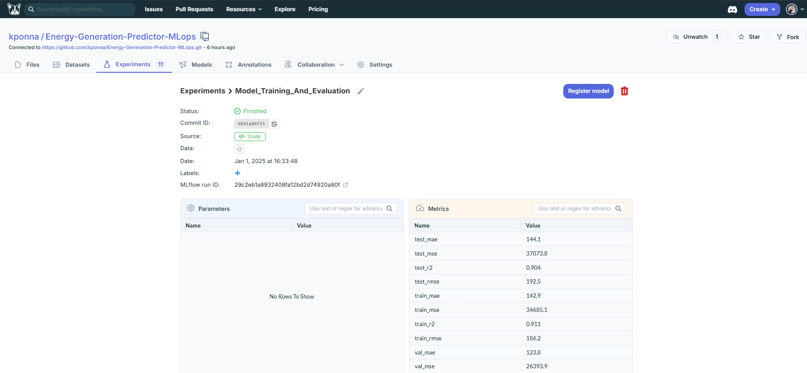

   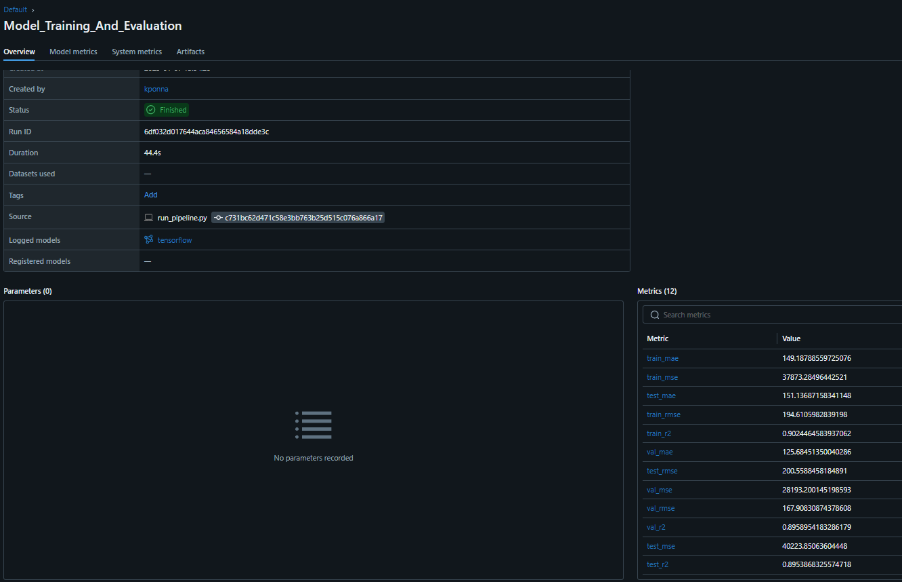 

   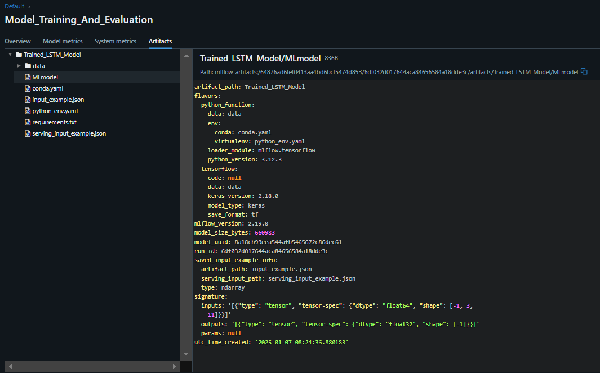 

- To run the training pipeline:
```bash
python run_pipeline.py
```
## CI/CD workflow - Github actions

GitHub Actions is leveraged to implement a robust CI/CD pipeline, automating the processes of Continuous Integration (CI), Continuous Delivery (CD), and Continuous Deployment (CD). This steps help maintain code quality and catch potential issues early in the development cycle. By using a self-hosted runner, GitHub Actions automatically listens for new jobs and triggers deployment whenever code is pushed to the repository. This ensures that the latest code changes are tested, built, and deployed seamlessly, reducing manual intervention and enhancing the efficiency of the development process.

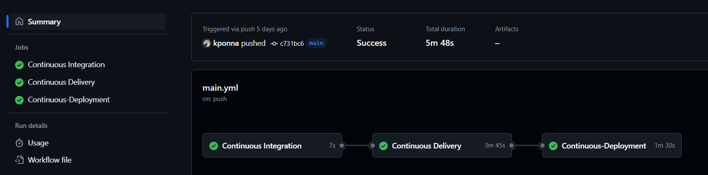

1. **Continuous Integration**

GitHub Actions automatically runs on every push to the main branch, excluding updates to the README.md file. This phase ensures the integrity of the code by executing essential tasks such as checking out the repository, linting the code, and running unit tests.

2. **Continuous Delivery**

GitHub Actions takes the successfully integrated code and prepares it for deployment. This phase is triggered after the CI steps pass. It includes building a Docker image of the application, logging into Amazon ECR, and pushing the image to the ECR repository. This automated process simplifies the transition from development to production-ready code.

3. **Continuous Deployment**

GitHub Actions automatically deploys the newly built Docker image to a self-hosted environment. This phase pulls the latest Docker image from Amazon ECR, runs the image to serve users, and cleans up old Docker images and containers. This ensures that the latest version of the application is always deployed and operational, reducing manual intervention and accelerating the release cycle.
 
In this workflow, various AWS services, such as S3, ECR, EC2, and FastAPI, are integrated to deploy an application that provides batch predictions using FastAPI as the user interface.

1. **AWS S3:**

- S3 is used to store artifacts generated in each stages of the training pipeline. These artifacts include model checkpoints, training logs, and datasets, ensuring they are securely stored and easily accessible for further processing or evaluation.
- Artifacts are pushed to S3, creating a versioned storage system that allows for tracking the progress and results of each training iteration.

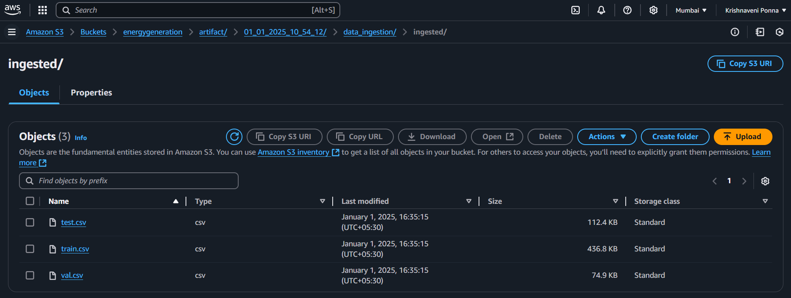

2. **Amazon Elastic Container Registry (ECR):**

ECR acts as the repository for Docker images built during the Continuous Delivery (CD) phase. The Docker image encapsulates the application, including the trained machine learning model and FastAPI-based user interface.
The built image is tagged and pushed to ECR, making it ready for deployment in the production environment.

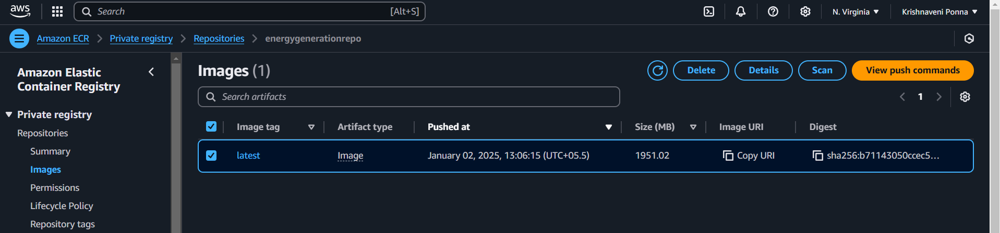

3. **Amazon Elastic Compute Cloud (EC2):**

EC2 instances are employed to host the application and serve the batch predictions. These instances pull the latest Docker image from ECR and run the containerized application.
The use of EC2 provides a scalable and flexible environment to handle varying workloads, ensuring that the application remains responsive under different usage conditions.

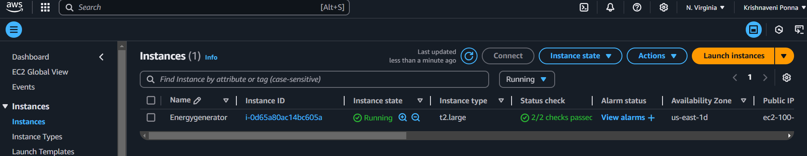

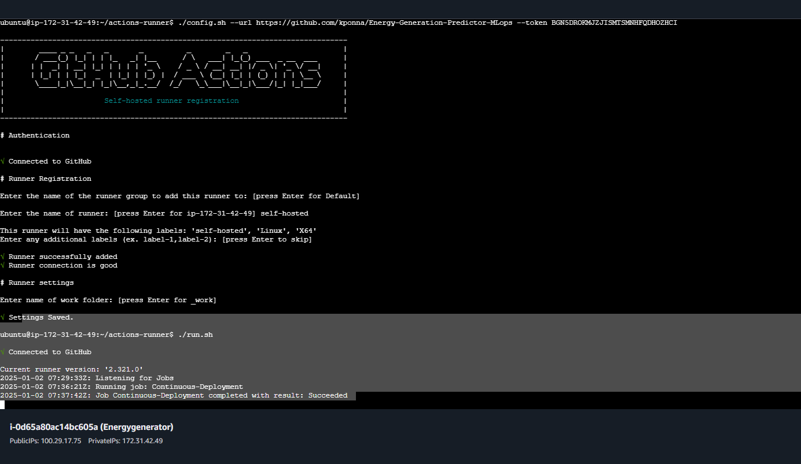
 
4. **FastAPI:**

FastAPI serves as the user interface for the deployed application, offering a RESTful API for batch predictions.
Users interact with the FastAPI endpoints to submit data batches and receive predictions. The FastAPI application is designed to handle requests efficiently, leveraging the trained model stored in the Docker container.

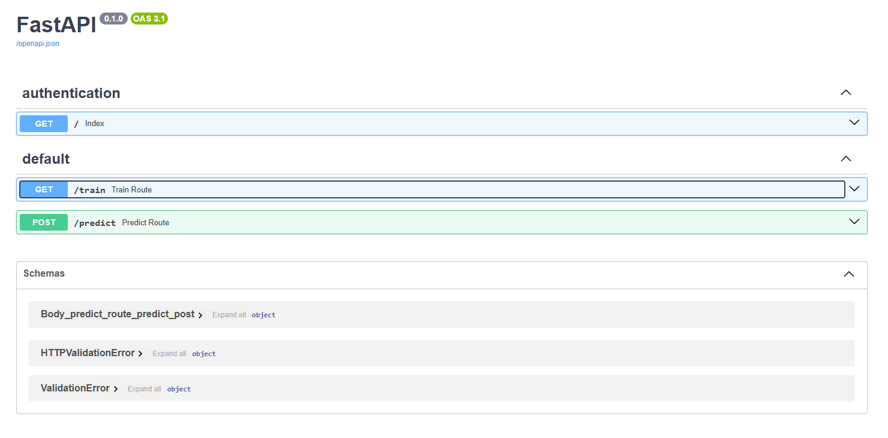

- **To run fastapi app locally**
```bash
uvicorn app:app --reload
```
- **To run fastapi app on cloud**: Create AWS ECR, EC2 instance, setup github actions and run below code.
```bash
python app.py
``` 
- **API Routes**
   - **Train route**: The `/train` route is a crucial endpoint designed to initiate the training process of the machine learning model. When a POST request is sent to this route, it triggers the model to start training using the predefined dataset and parameters. This route is particularly useful for retraining the model, whether to improve its accuracy or to incorporate new data. By using this route, you can ensure that your model stays updated and performs optimally.

   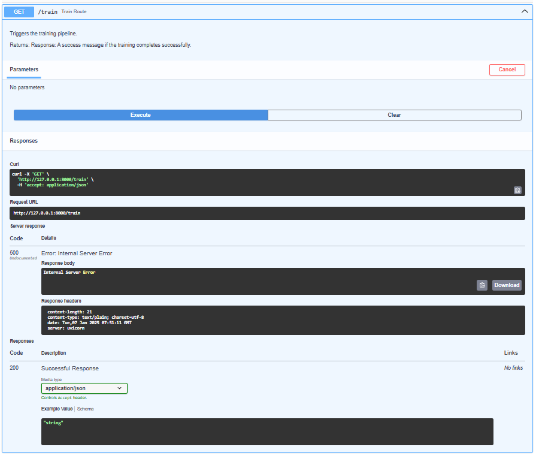
   
   - **Predict route**: The `/predict` route serves the purpose of making batch predictions using the trained model. It also accepts POST requests, but the input must be a .csv file containing the data you wish to predict on. Upon receiving the file, the route processes the input data, utilizes the trained model to generate predictions, and then returns the results in json. This route is ideal for applying the model to new datasets, enabling efficient and large-scale prediction tasks.

   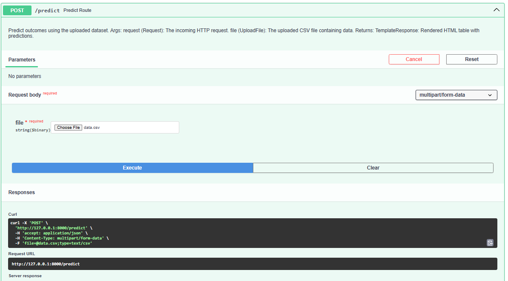
 
## How to Run the Project 🚀
This section provides a step-by-step guide on how to set up and run the Malicious URL Detection project both locally and in a deployed environment.

### Pre-requisites
- Docker
- MongoDB
- Python 3.8+
- Dagshub account
- Cloud account (AWS/GCP/Azure)
- GitHub Actions setup

### Local step 🔧
1. **Clone the repository**
```bash
   git clone https://github.com/your-username/Energy-Generation-Predictor-MLops.git
   cd Energy-Generation-Predictor-MLops 
``` 
2. **Set Up a Virtual Environment**:
```bash
# For macOS and Linux:
python3 -m venv venv 
# For Windows:
python -m venv venv
``` 
3. **Activate the Virtual Environment**:
```bash
# For macOS and Linux:
source venv/bin/activate 
# For Windows:
.\venv\Scripts\activate
``` 
4. **Install Required Dependencies**:
```bash
pip install -r requirements.txt
```

### Contact 📫
For any questions, suggestions, or collaboration opportunities, feel free to reach out:

📧Email: ponnakrishnaveni76@gmail.com 

🌐 LinkedIn: [Krishnaveni Ponna](https://www.linkedin.com/in/krishnaveni-ponna-28ab93239)

🐦 Twitter: [@Krishnaveni076](https://x.com/Krishnaveni076)
